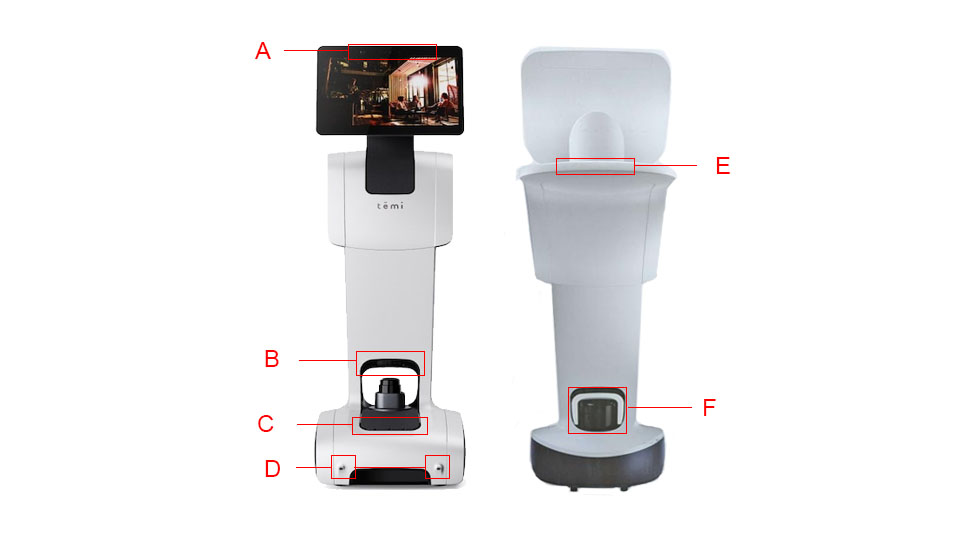
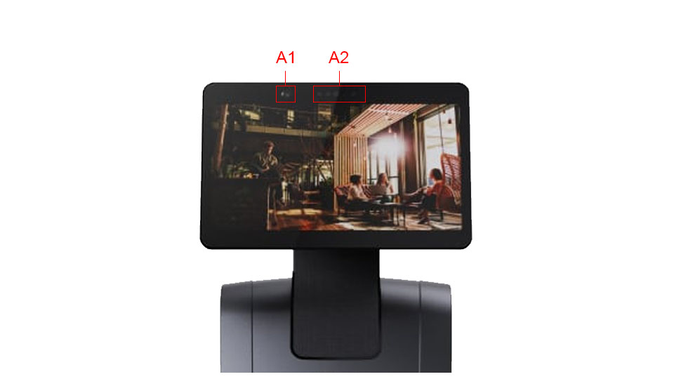

*************
Robot Sensors
*************

  Robot sensors: (A) head depth camera (see below for details), (B) ground depth camera, (C) front ToF sensors, (D) cliff sensors, (E) rear ToF sensors, (F) LIDAR.
 

  Head sensors: (A1) Wide angle camera, (A2) head depth camera. 

.. Important::
  Ensure that the sensors are free of dust, fingerprints, or any occlusion. A micro-fiber cloth and/or compressed air duster can be used to clean the sensors.

.. As with all optical sensors, environmental lighting, as well as surface reflection, transmission, and absorption affect what the sensors are able to detect. In turn, these can affect navigation performance.

Camera
=======
The wide-angle cameras located on the robot's head can be used by apps for taking photos and/or videos as well as for video calls. They are not used for navigation.

+---------------------+------+------+
|                     | HFOV | VFOV |
+=====================+======+======+
| Wide-angle camera   | 120°  | 48°  |
+---------------------+------+------+

LIDAR
=====
The primary navigation sensor is the laser, imaging, detection, and ranging (`LIDAR <https://en.wikipedia.org/wiki/Lidar>`_) sensor. It is used for mapping the environment and it assists with detecting obstacles.

.. @TODO Multiple versions of the LIDAR

Depth Cameras
=============
The robot has 2 depth cameras. One that is embedded into the head, and one just above the LIDAR:

- **Head Depth Camera**: This is used for face recognition in conjunction with the wide-angle camera and for tracking people. Blocking this camera will prevent the robot from following.  
- **Ground Depth Camera**: This is used to detect obstacles directly in front of the robot on the floor. It is also used to detect *cliffs*, e.g. stairs, escalators, genkan, etc. in medium range.

.. Tip:: The robot is unable to detect obstacles shorter than 10cm.
.. @TODO Multiple versions of the Depth Camera

ToF Sensors
===========
The robot has three sets of Time-of-Flight (ToF) sensors. Three in the front pointing upwards, three in the rear (under the tray) pointing downwards and two located in front (bottom protrusions):

- **Front ToF Sensors**: These are used to detects obstacles, such as tables directly in front of the robot.
- **Rear ToF Sensors**: These are used to detect *cliffs*, e.g. stairs, escalators, genkan, etc. directly behind the robot when moving backwards.
- **Cliff ToF Sensors**: These are used to detect *cliffs* exclusively, e.g. stairs, escalators, genkan, etc. in close range.

.. Tip:: Do not rely on the depth cameras or the ToF sensors. They do not work reliably. We recommend reducing their use (e.g. lower the obstacle avoidance sensitivity or turn them off completely), and to use virtual walls in the map.
